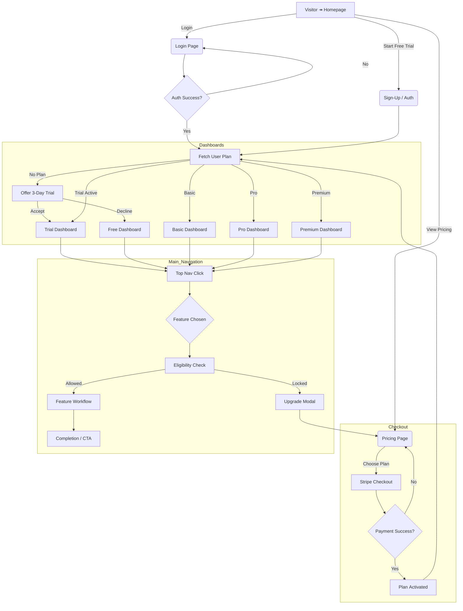
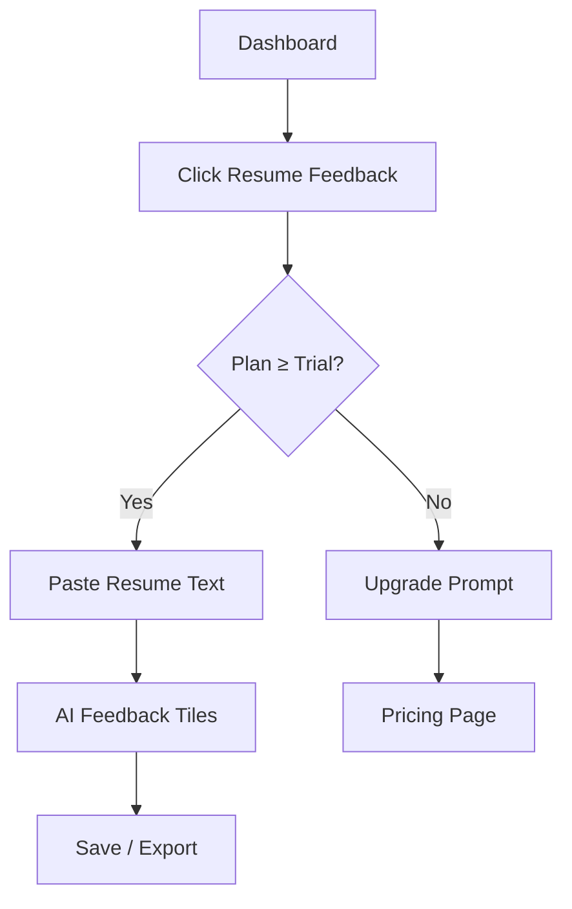
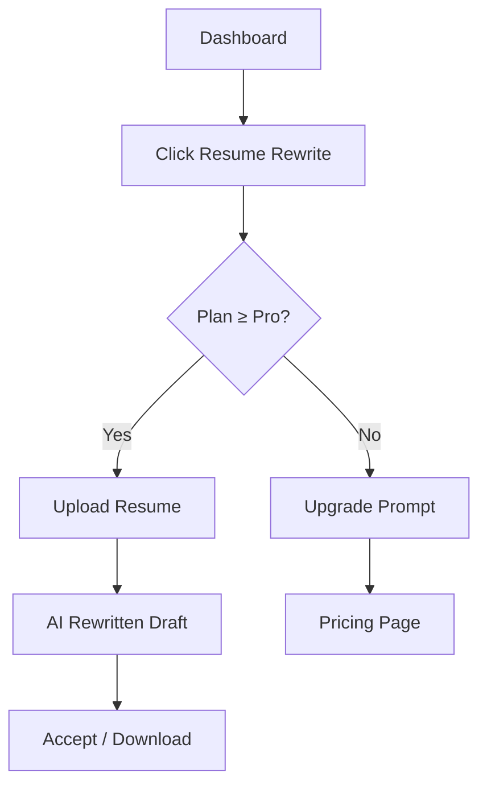
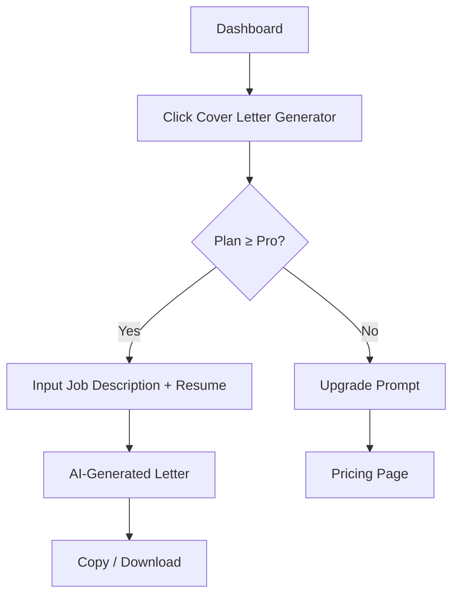
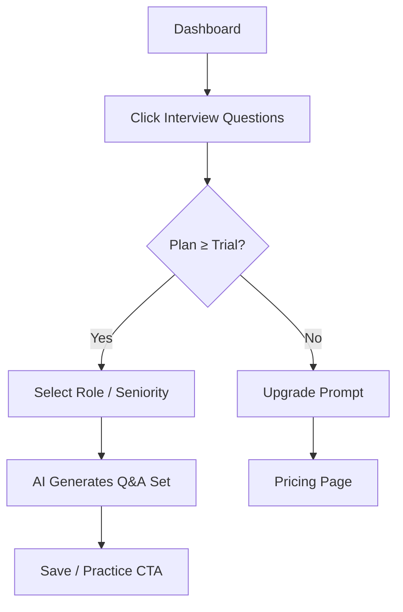
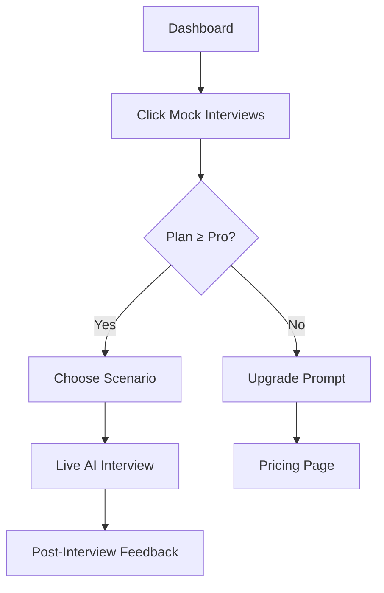
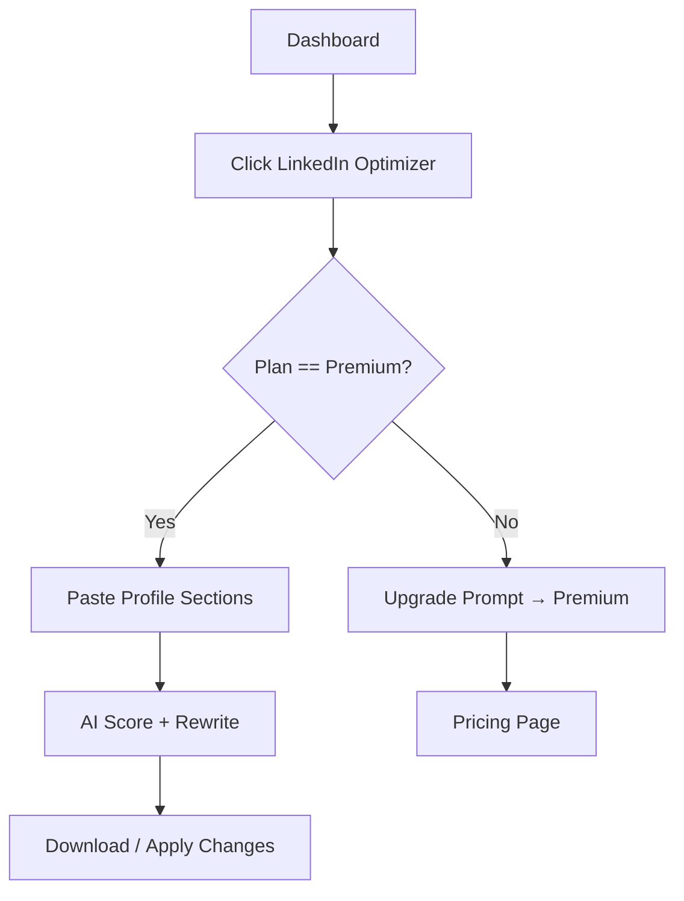

# JobHackAI UX Flowcharts & Navigation Overview
_All diagrams use Mermaid syntax. Paste this markdown into any Mermaid‑enabled viewer (GitHub, Obsidian, VS Code, etc.) to see the rendered flows._

---

## Revised Navigation Bars

| User State | Primary Nav Items (left ➜ right) | Notes |
|------------|----------------------------------|-------|
| **Logged‑out / Visitor** | Home · What You Get · Pricing · Blog · **Login** · **Start Free Trial (CTA)** | CTA styled with primary green `#007A30` |
| **Free Account (no plan)** | Dashboard · ATS Scoring · Resume Feedback 🔒 · Interview Questions 🔒 · Pricing/Upgrade (CTA) · Account · Logout | Locked items show gray 🔒 icon; clicking triggers Upgrade modal |
| **3‑Day Trial** | Dashboard · ATS Scoring · Resume Feedback · Interview Questions · Pricing/Upgrade (reminder) · Account · Logout | Trial ribbon top‑right; lock icons persist on premium‑only tools |
| **Basic $29** | Dashboard · ATS Scoring · Resume Feedback · Interview Questions · Upgrade → Pro (CTA) · Account · Logout | Resume Rewrite et al. appear with 🔒 |
| **Pro $59** | Dashboard · ATS Scoring · Resume Feedback · Resume Rewrite · Cover Letter · Interview Questions · Mock Interviews · Upgrade → Premium (CTA) · Account · Logout | LinkedIn Optimizer shown but locked |
| **Premium $99** | Dashboard · ATS Scoring · Resume Feedback · Resume Rewrite · Cover Letter · Interview Questions · Mock Interviews · LinkedIn Optimizer · Account · Logout | Full access, no upgrade CTA |

---

## 1 Comprehensive Site Flow  



---

## 2 ATS Resume Scoring Flow  

```mermaid
flowchart TD
  A[Dashboard] --> B[Click ATS Score]
  B --> C{Plan & Quota}
  C -->|Eligible| D[Upload/Paste Resume]
  D --> E[AI Scoring & Report]
  E --> F[Next Step CTAs (Download, Feedback)]
  C -->|Not Eligible| G[Lock Modal → Upgrade]
  G --> H[Pricing Page]
```

---

## 3 Resume Feedback Flow  



---

## 4 Resume Rewrite Flow  



---

## 5 Cover Letter Generator Flow  



---

## 6 Interview Questions Flow  



---

## 7 Mock Interviews Flow  



---

## 8 LinkedIn Optimizer Flow  



---

### Next Steps / Pushback  
1. **Error & recovery flows** (e.g., failed payment, file‑upload errors) aren’t mapped—worth adding before go‑live.  
2. **Email & notification journeys** (trial expiry, payment receipts) will need their own flow layer.  
3. Consider **A/B test branches** for Pricing & Upgrade modals if conversion optimisation is a priority.

---

_© 2025 JobHackAI — internal UX architecture draft_

