# JobHackAI UX Flowcharts & Navigation Overview
_All diagrams use Mermaid syntax. Paste this markdown into any Mermaid‑enabled viewer (GitHub, Obsidian, VS Code, etc.) to see the rendered flows._

---

## Revised Navigation Bars

| User State | Primary Nav Items (left ➜ right) | Notes |
|------------|----------------------------------|-------|
| **Logged‑out / Visitor** | Home · What You Get · Pricing · Blog · **Login** · **Start Free Trial (CTA)** | CTA styled with primary green `#007A30` |
| **Free Account (no plan)** | Dashboard · ATS Scoring · Resume Feedback 🔒 · Interview Questions 🔒 · Pricing/Upgrade (CTA) · Account · Logout | Locked items show gray 🔒 icon; clicking triggers Upgrade modal |
| **3‑Day Trial** | Dashboard · ATS Scoring · Resume Feedback · Interview Questions · Pricing/Upgrade (reminder) · Account · Logout | Trial ribbon top‑right; lock icons persist on premium‑only tools |
| **Basic $29** | Dashboard · ATS Scoring · Resume Feedback · Interview Questions · Upgrade → Pro (CTA) · Account · Logout | Resume Rewrite et al. appear with 🔒 |
| **Pro $59** | Dashboard · ATS Scoring · Resume Feedback · Resume Rewrite · Cover Letter · Interview Questions · Mock Interviews · Upgrade → Premium (CTA) · Account · Logout | LinkedIn Optimizer shown but locked |
| **Premium $99** | Dashboard · ATS Scoring · Resume Feedback · Resume Rewrite · Cover Letter · Interview Questions · Mock Interviews · LinkedIn Optimizer · Account · Logout | Full access, no upgrade CTA |

---

## 1 Comprehensive Site Flow  

```mermaid
flowchart TD
  %% ENTRY
  A[Visitor ↠ Homepage] -->|Login| B(Login Page)
  A -->|Start Free Trial| C(Sign‑Up / Auth)
  A -->|View Pricing| D(Pricing Page)

  %% AUTH / PLAN DECISION
  subgraph Checkout
    D -->|Choose Plan| E[Stripe Checkout]
    E --> F{Payment Success?}
    F -->|Yes| G[Plan Activated]
    F -->|No| D
  end

  B --> H{Auth Success?}
  H -->|Yes| I[Fetch User Plan]
  H -->|No| B
  C --> I
  G --> I

  %% ROUTING BY PLAN
  subgraph Dashboards
    I -->|No Plan| J[Offer 3‑Day Trial]
    J -->|Accept| K[Trial Dashboard]
    J -->|Decline| L[Free Dashboard]
    I -->|Trial Active| K
    I -->|Basic| M[Basic Dashboard]
    I -->|Pro| N[Pro Dashboard]
    I -->|Premium| O[Premium Dashboard]
  end

  %% COMMON NAV ➜ FEATURE SELECT
  subgraph Main_Navigation
    K & L & M & N & O --> P[Top Nav Click]
    P --> Q{Feature Chosen}
    Q --> R[Eligibility Check]
    R -->|Allowed| S[Feature Workflow]
    S --> T[Completion / CTA]
    R -->|Locked| U[Upgrade Modal]
    U --> D
  end
```



---

## 2 ATS Resume Scoring Flow  

```mermaid
flowchart TD
  A[Dashboard] --> B[Click ATS Score]
  B --> C{Plan & Quota}
  C -->|Eligible| D[Upload/Paste Resume]
  D --> E[AI Scoring & Report]
  E --> F[Next Step CTAs (Download, Feedback)]
  C -->|Not Eligible| G[Lock Modal → Upgrade]
  G --> H[Pricing Page]
```

---

## 3 Resume Feedback Flow  

```mermaid
flowchart TD
  A[Dashboard] --> B[Click Resume Feedback]
  B --> C{Plan ≥ Trial?}
  C -->|Yes| D[Paste Resume Text]
  D --> E[AI Feedback Tiles]
  E --> F[Save / Export]
  C -->|No| G[Upgrade Prompt]
  G --> H[Pricing Page]
```



---

## 4 Resume Rewrite Flow  

```mermaid
flowchart TD
  A[Dashboard] --> B[Click Resume Rewrite]
  B --> C{Plan ≥ Pro?}
  C -->|Yes| D[Upload Resume]
  D --> E[AI Rewritten Draft]
  E --> F[Accept / Download]
  C -->|No| G[Upgrade Prompt]
  G --> H[Pricing Page]
```



---

## 5 Cover Letter Generator Flow  

```mermaid
flowchart TD
  A[Dashboard] --> B[Click Cover Letter Generator]
  B --> C{Plan ≥ Pro?}
  C -->|Yes| D[Input Job Description + Resume]
  D --> E[AI‑Generated Letter]
  E --> F[Copy / Download]
  C -->|No| G[Upgrade Prompt]
  G --> H[Pricing Page]
```



---

## 6 Interview Questions Flow  

```mermaid
flowchart TD
  A[Dashboard] --> B[Click Interview Questions]
  B --> C{Plan ≥ Trial?}
  C -->|Yes| D[Select Role / Seniority]
  D --> E[AI Generates Q&A Set]
  E --> F[Save / Practice CTA]
  C -->|No| G[Upgrade Prompt]
  G --> H[Pricing Page]
```



---

## 7 Mock Interviews Flow  

```mermaid
flowchart TD
  A[Dashboard] --> B[Click Mock Interviews]
  B --> C{Plan ≥ Pro?}
  C -->|Yes| D[Choose Scenario]
  D --> E[Live AI Interview]
  E --> F[Post‑Interview Feedback]
  C -->|No| G[Upgrade Prompt]
  G --> H[Pricing Page]
```



---

## 8 LinkedIn Optimizer Flow  

```mermaid
flowchart TD
  A[Dashboard] --> B[Click LinkedIn Optimizer]
  B --> C{Plan == Premium?}
  C -->|Yes| D[Paste Profile Sections]
  D --> E[AI Score + Rewrite]
  E --> F[Download / Apply Changes]
  C -->|No| G[Upgrade Prompt → Premium]
  G --> H[Pricing Page]
```



---

### Next Steps / Pushback  
1. **Error & recovery flows** (e.g., failed payment, file‑upload errors) aren’t mapped—worth adding before go‑live.  
2. **Email & notification journeys** (trial expiry, payment receipts) will need their own flow layer.  
3. Consider **A/B test branches** for Pricing & Upgrade modals if conversion optimisation is a priority.

---

_© 2025 JobHackAI — internal UX architecture draft_

